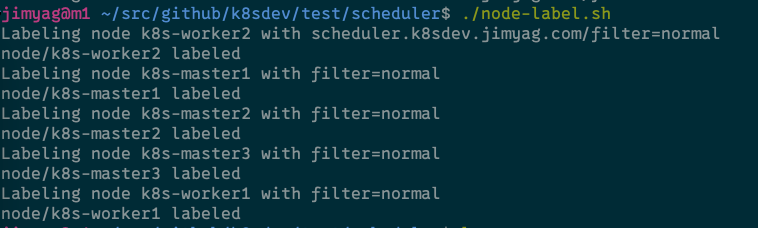
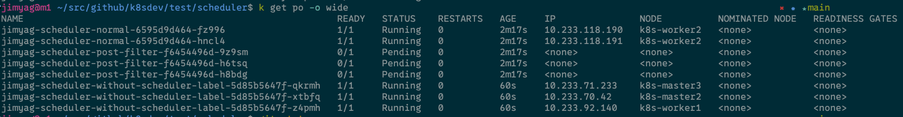

# 自定义调度器

实现了一个通过过滤特定标签的调度器。

## 部署

修改 Makefile 中的 `baseImageUrl` 为自己的镜像站地址
在仓库根目录执行如下命令，复制编译的镜像名称

```shell
make container-scheduler
```

到 scheduler 目录中找到 deploy 中的 deployment.yaml，修改为刚刚复制的镜像名称

在 deploy 目录中执行即可部署 scheduler

```shell
kubectl apply -f ./
```

## 使用

在 scheduler/test 目录中首先执行 `./node-label.sh`（只需要执行一次即可）


再执行

```shell
kubectl apply -f ./
```

查看 pod 的调度情况，有 `scheduler.k8sdev.jimyag.com/filter=normal` 被调度到 `k8s-worker2`

`scheduler.k8sdev.jimyag.com/filter=post-filter` 的 pod 由于找不到对应的 node，一直处于 Pending 状态
不包含 `scheduler.k8sdev.jimyag.com/filter` 的 pod 被随机调度

